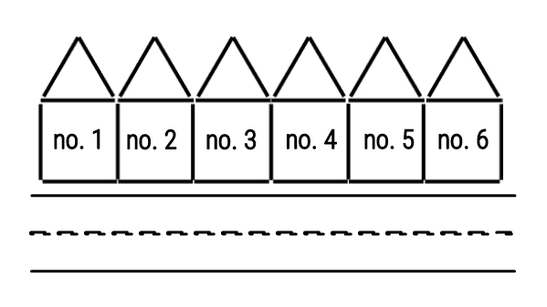
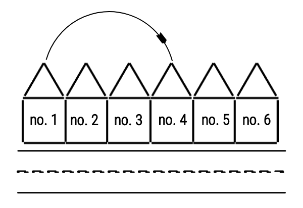
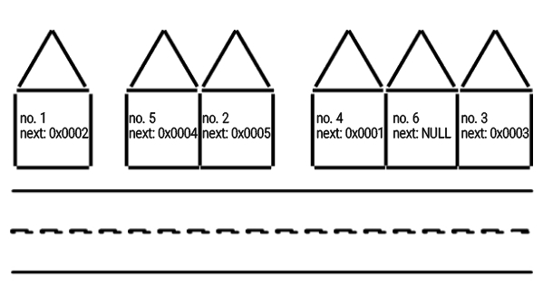
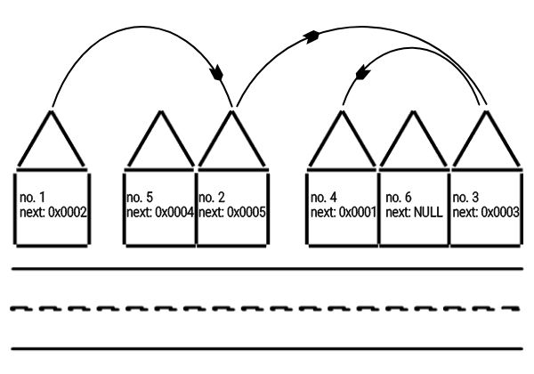
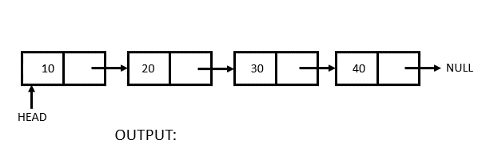

# Linked List Data Structure
According to the [Feymann learning technique](https://fs.blog/feynman-learning-technique/), one of the ways we mask our lack of understanding is by using complicated vocabulary and jargon. The truth is, if you can’t clearly and simply define the words and terms you are using, you don’t really know what you’re talking about.

It follows that if one can't explain a concept in the simplest possible terms that would be easily understood by a sixth-grader, one doesn't truly understand that concept but if one can find a way to do that, one would have also have learned a lot more about the concept on a more intuitive level.

Okay, enough with Feymann, I just want to use a simple illustration of two imaginary streets to explain the concept of a linked list and I hope that would be good enough for even a "six grader" to grasp.

## Arrays and Linked Lists  
Arrays and Linked lists are simple data structures used by computer programmers.

**Array**: Arrays store elements in contiguous memory locations, resulting in easily calculable addresses for the elements stored and this allows faster access to an element at a specific index.

**Linked List**: Linked lists are less rigid in their storage structure and elements are usually not stored in contiguous locations, hence they need to be stored with additional tags giving a reference to the next element.

## Posh Street
Now try to imagine a street, perhaps in an estate where the buildings are well planned and the house are numbered in order. 

**Posh Street off Array Avenue**
 <p align="center">
    
</p>

The street would look something like the picture shown above.

We know that the houses are numbered orderly so to navigate through this street we can calculate the exact location of any given house address number by subtracting the address of the first house from the address we are trying to locate.

Perhaps you are delivery guy, trying to deliver a package to no. 4 on Posh Street off Array Avenue. On getting to the gate of the street, all you have to do is count ```3 = 4 - 1``` houses from the first house to get to the house that the package is meant to be delivered to

<p align="center"></p>

```
location = sizeof(element) * (index - start) 
```
This is exactly the same way array elements are processed in the computer memory. Every array (on a low level) is just a pointer to the first element of the array and to calculate location of any given index, the computer simply subtracts the index of the first element (which is always 0) from the given index and multiplies by the size of a single element in the array. 

<p align="center"></p> 

Now imagine yourself as the delivery guy again, in quite an unfortunate situation where you have to deliver a package somewhere in the suburbs where buildings aren't planned and houses are scattered all over with unordered numberings. 

## Trenches Street

**Trenches Street off Linked-List Road**
<p align="center">
    
</p>

A simple means by which an unordered street like the one pictured above could be navigated is by storing a special tag perhaps a high precision GPS coordinate that points to the location of the building with the next number in each building along the street. 

Now as a delivery guy, let's say the package is also addressed to no. 4 Trenches street of Linked-List Road. You'd simply have to go the first house which would hopefully be no. 1 from which you'd get the GPS coordinates for no. 2 and then move on from house no. 2 again to get to house no. 3 and finally to no. 4! 

<p align="center"></p>

Even if we are going to house no. 100, we'd simply have to locate the first house get the coordinates of the next and move on from there to the next and then again to the next until we locate the house we seek.  

That's basically how a linked list data structure also works in the memory of a computer. 

<p align="center"></p>

In C Programming Language which is considered as perhaps the most "low-level language", a linked list is usually represented with a structure datatype that typically looks like this: 

```
struct singly-linked-list
{
	int n;
	struct singly-linked-list *next;
}
```
Containing the house number – ```int n``` and the high precision GPS coordinates pointer to the next house – ```struct singly-linked-list *next```. 

### Doubly Linked-List
So far, in Trenches street we've made provision for coordinates to the next house location which means you can only tarnverse the street in one direction.  
  
What if after getting to house no. 100 you realise there's another package meant for house no. 73 then you have to go back all the way to the beginning and start hopping to nexts again until you get to house no. 73?   

Luckily for us there's also a solution to that, in form of Doubly Linked List!    

<p align="center"></p>

And it typically looks like this in C Programming:

```
struct doubly-linked-list
{
	int n;
	struct doubly-linked-list *prev;
	struct doubly-linked-list *next;
}
```
Containing another high precision GPS coordinates pointer to the previous house – ```struct singly-linked-list *prev```.  
  
## What's the whole point of this Linked List stress? 

The main reason why linked lists are used, the primary advantage they offer over the traditional arrays data structure, is that since data can only be stored in contiguous blocks of memory in an array, its size cannot be altered at runtime due to the risk of overwriting other data.  

However, in a linked list, each node points to the next one such that data can exist at scattered (non-contiguous) addresses; this allows for a dynamic size that can changed at runtime!   

However there are also downsides of using a linked list such as random access is not allowed. We have to access elements sequentially starting from the first node.  

Extra memory space for a pointer is required for each element of the list and arrays have a better cache locality that can make a pretty big difference in performance.